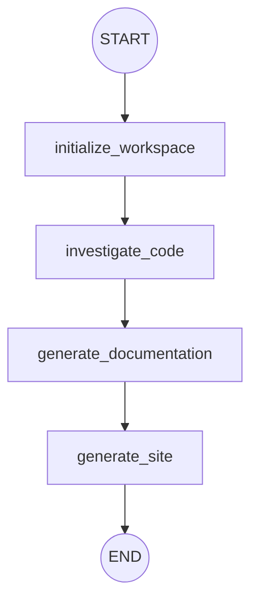

<p align="center">
  <h1 align="center">Diátaxis Web</h1>
   <h2 align="center">Automated Technical Documentation Generator</h2>
</p>

<p align="center"> 
    
    
    
    
    
    
</p>


Diátaxis Web is an automated technical documentation generation system powered by **Google Agent Development Kit (ADK) 2.0** utilizing the new **Graph Workflow API**. It processes public GitHub repositories, analyzes the code architecture, and writes documentation aligned to the four pillars of the Diátaxis framework (Tutorials, How-To Guides, References, and Explanations) inside an isolated local sandbox.

---

## 1. The Problem

Writing and maintaining high-quality technical documentation is one of the most significant challenges in software engineering. Key problems include:

- **Structure & Style Inconsistency**: Documentation often mixes tutorials, references, and theoretical explanations, confusing readers and reducing readability.
- **Out-of-Date Manuals**: Codebases evolve rapidly. Manual documentation quickly becomes obsolete as endpoints, signatures, and architectures change.
- **Security & Privacy Overhead**: Sending entire private code repositories to external, untrusted AI analysis tools presents severe security risks (leaking credentials, secrets, or Intellectual Property).
- **High Cognitive Cost**: Engineers spend valuable development hours writing, formatting, and structuring text rather than focusing on building features.

---

## 2. The Solution

**Diátaxis Web** addresses these challenges by automating the documentation lifecycle using structural AI agent networks:

- **Diátaxis Framework Integration**: Every generated file is aligned strictly to one of the four user-oriented documentation quadrants (Tutorials, How-To Guides, References, or Explanations).
- **Isolated Local Sandbox**: Codebases are cloned, sanitized of secrets, caches, and media files locally before analysis, simulating secure Google Sandbox environments.
- **Dynamic Structural Generation**: Utilizes Google GenAI (Gemini) to inspect parsed codebase maps and output clean static sites (HTML/CSS/JS) automatically.
- **Continuous Quality Control**: Implements a writer-judge AI feedback loop to grade, revise, and refine draft documentation before final delivery.

---

## 3. System Architecture

The project is designed using the modular **ADK 2.0 Graph Workflow API**, moving away from legacy linear orchestrations. The workflow topology defines four major functional nodes:



1. **`initialize_workspace` (Orchestrator)**: Creates a session directory with a random UUID, clones the Git repository, and applies recursive sanitization filters (deleting `node_modules`, `.env`, lockfiles, and media files).
2. **`investigate_code` (Researcher)**: Inspects the sanitized source code structure to extract core endpoints, dependencies, and architectural patterns, saving a technical `analysis_summary.txt`.
3. **`generate_documentation` (Writers & Judges)**: Runs an iterative loop (max 3 rounds) where a Writer agent drafts technical pages following Diátaxis guidelines, and a Judge agent evaluates, approves, or provides critiques.
4. **`generate_site` (SiteWriter / A2UI)**: Takes approved Markdown files, transforms them into static web assets (HTML/CSS/JS) based on design rules from `sitewriter.md`, compresses everything into `documentation.zip`, and invokes a background task to safely delete the session folder.

---

## 4. Setup & Installation

### Prerequisites
- Python 3.11 or later
- [uv](https://docs.astral.sh/uv/getting-started/installation/index.md) (highly recommended fast package installer)

### 1. Configure Credentials
Copy the environment template:
```bash
cp .env.example .env
```
Open `.env` and set your credentials:
* **Option A (AI Studio API Key)**: Add your `GEMINI_API_KEY=your_key_here` and comment out the Vertex AI settings.
* **Option B (Google Cloud Vertex AI)**: Enable `GOOGLE_GENAI_USE_VERTEXAI=true` and set your `GOOGLE_CLOUD_PROJECT` and `GOOGLE_CLOUD_LOCATION`.

For detailed authentication steps, refer to [AUTH_SETUP.md](AUTH_SETUP.md).

### 2. Install Project Dependencies
Initialize the virtual environment and synchronize dependencies:
```bash
uv venv
uv pip install -r pyproject.toml
```

---

## 5. Execution Instructions

### Start the Web Application
To launch the FastAPI development server (which serves the frontend landing page and API endpoints):
```bash
uv run python app/fast_api_app.py
```
Open your browser and navigate to the custom landing page:
👉 **[http://localhost:8000/static/index.html](http://localhost:8000/static/index.html)**

### Run Console Tests
To run the agent workflow pipeline locally using terminal commands with a mock payload:
```bash
uv run python main.py
```

